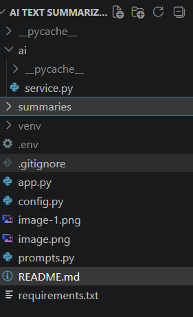
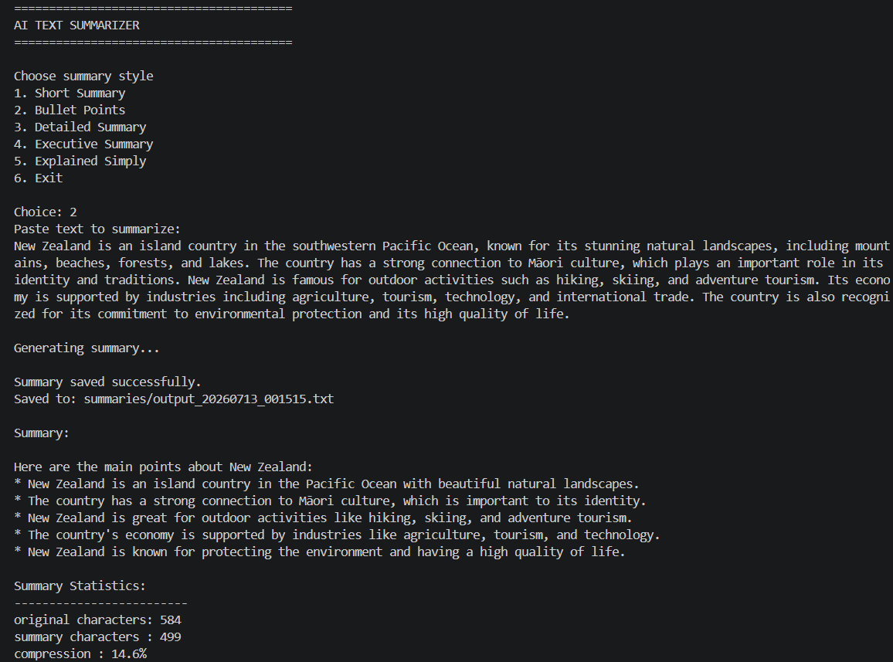
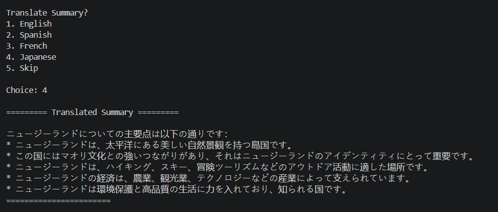

# AI Text Summarizer sample
New Zealand is an island country in the southwestern Pacific Ocean, known for its stunning natural landscapes, including mountains, beaches, forests, and lakes. The country has a strong connection to Māori culture, which plays an important role in its identity and traditions. New Zealand is famous for outdoor activities such as hiking, skiing, and adventure tourism. Its economy is supported by industries including agriculture, tourism, technology, and international trade. The country is also recognized for its commitment to environmental protection and its high quality of life.

## Overview

This project is the foundation of an AI-powered text summarizer.

The application allows a user to:

Enter text
Select a summary style
Save the request to a file

## Features

Multiple summary styles using AI
Prompt templates
Environment variables
File handling
Traslating options
save every summary
basic Error handling

## Installation
python -m venv venv
pip install python-dotenv
pip install openai

## Project Structure

Install dependencies:
pip install -r requirements.txt

# OpenAI-compatible API  - Groq's free API
https://console.groq.com
api_key=os.getenv("GROQ_API_KEY")
base_url="https://api.groq.com/openai/v1"
client.chat.completions.create(...)
model="llama-3.3-70b-versatile"
return response.choices[0].message.content

## Run
python app.py

# Git
git add .
git commit -m "Add ........"
git push

# Screenshots
summarized

Translated 

# Future Improvements
Support additional languages
Export summaries as PDF or Word documents
Process multiple files in a batch
Add a graphical user interface (GUI)
Add unit tests
Allow users to choose different AI models
Display token usage for each request
Add configurable summary length
Save application logs
Support summarizing text from PDF and Word documents

